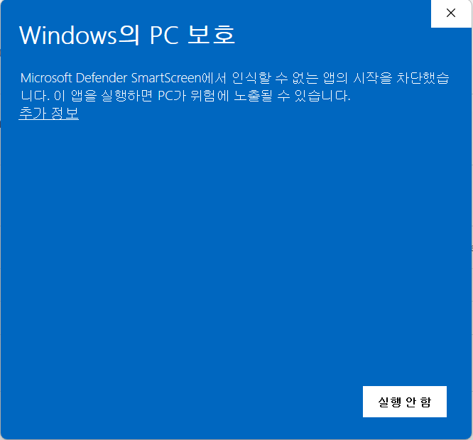

<p align="center"></p>

# HwanNote

     

> Windows 11 메모장 감성을 바탕으로 만든 데스크톱 마크다운 메모 앱

HwanNote는 Tauri v2 + React 18 + TypeScript 기반의 로컬 우선 메모 앱입니다. 메모는 기본적으로 표준 `.md` 파일로 저장되며, 폴더 분류, 탭 기반 편집, 분할 보기, 로컬/클라우드 라이브러리 전환, 자동 업데이트 같은 데스크톱 사용성을 함께 제공합니다.

## 현재 상태

- 최신 버전: `v0.3.4`
- 기본 저장소: `문서/HwanNote/Notes`
- 지원 언어: 한국어, English
- 기본 대상 플랫폼: Windows 10/11 (64-bit)
- Linux는 개발/빌드 환경을 지원하며 Ubuntu 24.04 기준 검증 흐름을 포함합니다.

## 주요 기능

### 편집

- 제목(H1~H3), 굵게, 기울임, 링크, 표, 글머리 기호, 번호 목록 지원
- 체크리스트와 중첩 체크 상태 저장
- Notion 스타일 토글/접기 블록 지원
- 상태바에서 `Markdown <-> Text` 형식 전환
- `.txt` 파일 가져오기 및 외부 `.txt` 파일 열기/저장
- 날짜/시간 삽입(`F5`)
- 링크 자동 감지 및 편집
- 편집기 맞춤법/문법 밑줄 표시 on/off

### 메모 / 탭 / 작업 공간

- 여러 메모를 탭으로 동시에 열기
- 탭 순서 드래그 앤 드롭 정렬
- 탭 고정, 다른 탭 닫기, 저장되지 않은 변경 표시
- 마지막으로 열어둔 탭 세션 복원
- 탭을 작업 영역 바깥으로 드롭해 좌우 분할 보기
- 분할 보기 비율 조절

### 폴더 / 검색 / 정리

- 계층형 폴더 생성, 이름 변경, 삭제
- 현재 선택한 폴더 문맥에서 새 메모 만들기
- 메모를 폴더로 드래그해서 이동
- 제목/내용/전체 기준 검색
- 해시태그 자동 추출과 태그별 필터링
- 최근 수정순, 이름순, 생성일순 정렬

### 저장 / 동기화

- 라이브러리 메모 자동 저장
- 기본 저장 경로 변경 지원
- 메모 삭제 시 휴지통 이동
- 로컬 라이브러리와 클라우드 라이브러리 전환
- OneDrive, Google Drive Desktop 폴더 기반 동기화 지원
- 앱 내 업데이트 확인, 다운로드, 설치 지원

### 설정

- 라이트 / 다크 / 시스템 테마
- 글꼴 크기 조절
- 줄 간격 조절
- 탭 크기 설정
- 단축키 변경 및 초기화

## 기술 스택

| 영역 | 기술 |
|---|---|
| 데스크톱 프레임워크 | Tauri v2 |
| 백엔드 | Rust |
| UI 프레임워크 | React 18 |
| 언어 | TypeScript |
| 에디터 엔진 | Tiptap (ProseMirror 기반) |
| 상태 관리 | Zustand |
| 빌드 도구 | Vite |

## 최근 반영된 내용

- `v0.3.4`
  - 에디터 클립보드 붙여넣기 시 공백 처리 개선
  - 최신 릴리스 버전 반영
- 최근 작업 기준
  - 라이브러리 메모 자동 저장 복구
  - 폴더 이동 경로 정규화 및 드래그 피드백 추가
  - 상단 `+` 탭 생성 시 현재 폴더 문맥 반영
  - Linux / Ubuntu 네이티브 실행 경로 안정화
  - 레거시 클라우드 동기화 설정 마이그레이션 보강
  - 저장 및 동기화 이후 메모 제목 유지 안정성 개선

## 저장 구조

기본적으로 메모는 로컬 라이브러리에 `.md` 파일로 저장됩니다.

- 로컬 기본 경로: `문서/HwanNote/Notes`
- 클라우드 연동 시 경로
  - OneDrive: `<OneDrive>/HwanNote/Notes`
  - Google Drive: `<Google Drive>/HwanNote/Notes`

클라우드 동기화는 별도 클라우드 API를 직접 호출하는 방식이 아니라, 데스크톱 동기화 클라이언트가 제공하는 로컬 동기화 폴더를 라이브러리 위치로 사용하는 방식입니다. 연동 후에는 설정에서 로컬 라이브러리와 클라우드 라이브러리 중 현재 보기를 전환할 수 있습니다.

## 다운로드 및 설치

최신 설치 파일은 [GitHub Releases](https://github.com/hwankr/hwanNote/releases)에서 받을 수 있습니다.

- Windows용 NSIS 설치 파일(`.exe`) 제공
- 설치 후 앱 내 업데이트 기능으로 최신 버전 유지 가능
- 코드 서명이 없어서 SmartScreen 경고가 나타날 수 있음

### Windows SmartScreen 경고

설치 파일에 코드 서명이 되어 있지 않아 실행 시 Windows Defender SmartScreen 경고가 표시될 수 있습니다.

<p align="center"></p>

`추가 정보`를 누른 뒤 `실행`을 선택하면 설치를 계속할 수 있습니다.

## 개발 환경 설정

### 요구사항

- Node.js `>= 20`
- Rust stable
- Windows 10/11 (64-bit) 또는 Linux
- Windows 빌드 시 Microsoft Visual Studio C++ Build Tools 또는 Visual Studio Community
  - `Desktop development with C++` 워크로드 필요

### Linux / WSL (Ubuntu 24.04) 준비

```bash
sudo apt update
sudo apt install -y \
  build-essential \
  curl \
  wget \
  file \
  libxdo-dev \
  libssl-dev \
  libayatana-appindicator3-dev \
  librsvg2-dev \
  libwebkit2gtk-4.1-dev \
  patchelf
```

Rust가 없다면:

```bash
curl --proto '=https' --tlsv1.2 -sSf https://sh.rustup.rs | sh -s -- -y
source "$HOME/.cargo/env"
```

자동화 스크립트:

```bash
npm run setup:linux
```

### 설치 및 실행

```bash
git clone https://github.com/hwankr/hwanNote.git
cd hwanNote
npm install
npm run dev
```

### 점검 및 검증 명령

| 명령어 | 설명 |
|---|---|
| `npm run dev` | Tauri 개발 모드 실행 |
| `npm run dev:frontend` | 프런트엔드만 Vite로 실행 |
| `npm run build` | 프로덕션 데스크톱 빌드 |
| `npm run build:frontend` | 프런트엔드 빌드 |
| `npm run preview` | 프런트엔드 빌드 결과 미리보기 |
| `npm run typecheck` | TypeScript 타입 검사 |
| `npm run verify:ubuntu` | Ubuntu 개발/빌드 baseline 검증 |

Linux에서 Tauri 환경 확인:

```bash
npm exec tauri info
```

`npm run verify:ubuntu`는 아래를 순서대로 확인합니다.

- TypeScript 타입 검사
- Tauri / Linux prerequisite 점검
- `cargo check`

### Windows 개발 체크리스트

1. Node.js 확인
   ```bash
   node -v
   npm -v
   ```
2. Rust 확인
   ```bash
   rustc -V
   cargo -V
   ```
3. MSVC 빌드 도구 확인
4. 프로젝트 실행
   ```bash
   npm install
   npm run typecheck
   npm run dev
   ```

### Windows + WSL 혼용 팁

- 같은 체크아웃에서 `node_modules`, `dist`, `src-tauri/target` 산출물을 Windows/WSL 환경끼리 섞어 쓰지 않는 것을 권장합니다.
- Windows를 주 개발 환경으로 쓸 때는 Windows에서 의존성을 설치하고 실행하세요.
- Linux/WSL을 주 개발 환경으로 쓸 때는 Linux 쪽에서 다시 의존성을 설치하세요.
- WSL에서 GUI 앱을 띄우려면 WSLg 같은 GUI 세션이 필요합니다.
- 이 저장소는 `.gitattributes`, `.editorconfig`를 통해 LF 기준을 유지합니다.

## 기본 단축키

| 기능 | 기본 단축키 |
|---|---|
| 새 메모 | `Ctrl+N` |
| 메모 저장 | `Ctrl+S` |
| 사이드바 토글 | `Ctrl+B` |
| 다음 탭 | `Ctrl+Tab` |
| 이전 탭 | `Ctrl+Shift+Tab` |
| 탭 닫기 | `Ctrl+W` |
| 굵게 | `Ctrl+B` (에디터 내) |
| 기울임 | `Ctrl+I` (에디터 내) |
| 체크리스트 토글 | `Ctrl+Shift+X` (에디터 내) |
| 토글 블록 삽입 | `Ctrl+Shift+T` (에디터 내) |
| 날짜/시간 삽입 | `F5` (에디터 내) |

모든 단축키는 설정에서 변경할 수 있습니다.

## 알려진 제한 사항

- Windows 11 스타일 제목 표시줄과 상호작용은 Windows 기준으로 가장 많이 다듬어져 있습니다.
- 클라우드 동기화는 OneDrive / Google Drive Desktop의 로컬 동기화 폴더 존재를 전제로 합니다.
- 로컬 저장 위치를 바꿔도 기존 메모를 자동 이동하지는 않습니다.
- 외부 파일 직접 열기는 현재 `.txt` 중심으로 동작합니다.
- 이미지 삽입/첨부 기능은 아직 지원하지 않습니다.

## 라이선스

이 프로젝트는 [MIT](./LICENSE) 라이선스로 배포됩니다.

<p align="center">
  Made by <a href="https://github.com/HwanKR">HwanKR</a><br>
  이 프로젝트가 유용했다면 GitHub에서 Star를 눌러 주세요.
</p>
